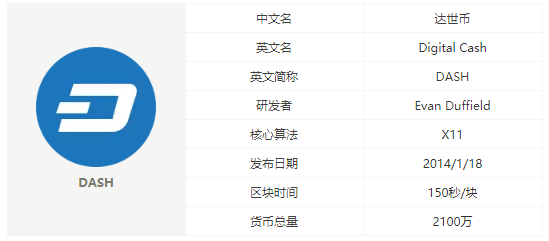

# DASH简介

## 1.什么是达世币？
  达世币，英文名DASH，是一种开源的点对点（P2P）加密货币，能够提供即时交易、匿
  名交易和替代货币功能。

  达世币网络是由工作量证明挖矿（比特币所使用的共识机制）机制来负责保护的，并且
  它使用的是基于11种不同哈希函数的X11算法。其主节点是一种服务证明
  （proof-of-service）层，这些节点同时作为交易混频器和助推器，此外它也作为达世
  币管理系统的投票机制。

  达世币的区块奖励会划分给两个层（矿工和主节点）。其中矿工获得45％的回报，主节
  点收到45%，剩余的10%则分配给去中心化的达世币预算系统，每个区块的产生时间是
  2.5分钟，一个区块给矿工3.6个达世币奖励。具体如下表
  

## 2.背景
  考虑到比特币匿名性和交易处理速度，Evan Duffield和团队开始了DASH的研发，并于
  2014年1月正式创立达世币。至此，达世币完成了在比特币的基础上的相关改进，以去
  中心化网络服务器“主节点”混淆交易的方式，提高了交易的匿名性。同时基于节点，提
  高了交易处理速度，由此诞生出了去中心化的和具备良好匿名性的达世币。

## 3.特点
  匿名性高：比特币交易中，所有交易数据都会被记录到数据块链中，比特币的去向可
  见，进而便能查询到接收和发送双方。然而达世币通过匿名发送的技术，以去中心化网
  络服务器“主节点”混淆交易的方式，使得交易无法被追踪查询，进而实现高匿名性。

  即时发送：比特币网络需要花费10分钟甚至数个小时来确认交易，达世币能够即时发送。

  自主管理系统：通过此系统，达世币网络可以通过提案与投票的方式为研发和营销进行
  资源配置，而且任何用户都可以在网络上创建并呈交提案。

## 4.常用链接
  [DASH官网](https://www.dash.org/)
  [区块浏览器](https://explorer.dash.org/chain/Dash)
  [钱包下载](https://www.dash.org/cn/get-dash/)
  [DASH论坛](https://www.dash.org/forum/)
